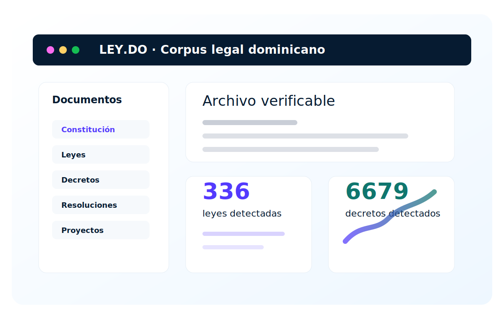
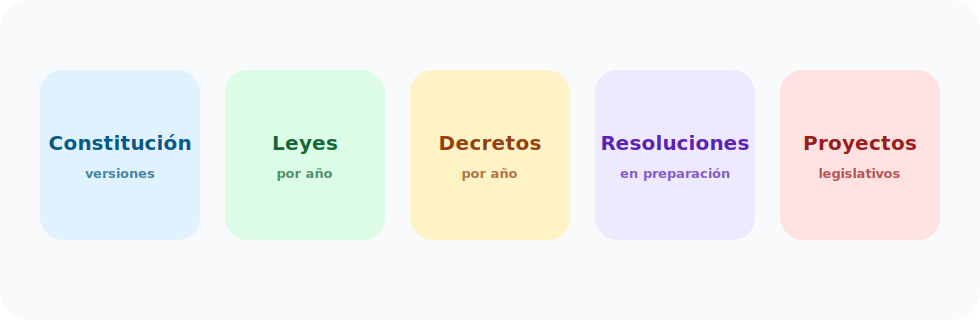

# LEY.DO

Archivo público independiente para consultar, auditar y reutilizar documentos legales dominicanos provenientes de fuentes oficiales.

[Explorar leyes](leyes/index.md){ .leydo-button }
[Explorar decretos](decretos/index.md){ .leydo-button }
[Ver Constitución](constitucion/index.md){ .leydo-button secondary }

!!! warning "Aviso importante"
    LEY.DO no es una página oficial del Gobierno dominicano. LEY.DO no ofrece asesoría legal. Verifique siempre cada documento contra la fuente oficial indicada.

## Corpus documental

### Constitución
Versiones constitucionales y documentos de reforma identificados en fuentes oficiales.

[Entrar](constitucion/index.md)

### Leyes
336
leyes detectadas 2016-2026 en Consultoría Jurídica

[Entrar](leyes/index.md)

### Decretos
6679
decretos detectados 2016-2026 en Consultoría Jurídica

[Entrar](decretos/index.md)

### Resoluciones
Área preparada para resoluciones oficiales.

[Entrar](resoluciones/index.md)

### Proyectos
Área preparada para proyectos legislativos provenientes de fuentes oficiales.

[Entrar](proyectos/index.md)

## Estado del archivo

El corpus se está construyendo por etapas: primero detección en fuentes oficiales, luego descarga del PDF oficial, cálculo de hashes, transcripción Markdown, metadata JSON y revisión humana.

| Área | Estado actual |
|---|---|
| Constitución | Versiones 2015 y 2024 detectadas en Consultoría Jurídica; pendiente normalización completa. |
| Leyes | Documentos detectados por año 2016-2026; algunos documentos normalizados inicialmente. |
| Decretos | Documentos detectados por año 2016-2026; lote inicial 2026 normalizado. |
| Resoluciones | Sección preparada; pendiente inventario específico. |
| Proyectos | Sección preparada; pendiente inventario específico. |

## Principios

- Fuente oficial primero.
- Sin interpretación legal.
- Sin inventar datos faltantes.
- Todo documento dudoso queda pendiente de revisión humana.
- Si hay conflicto entre LEY.DO y una fuente oficial dominicana, prevalece la fuente oficial.
